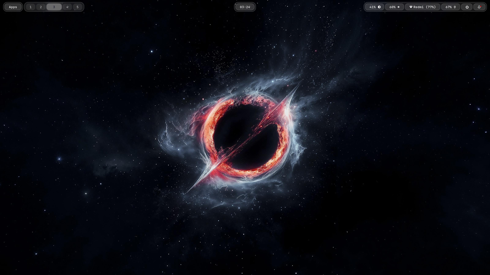
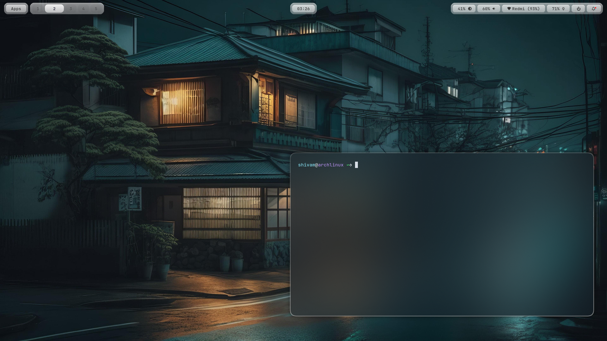
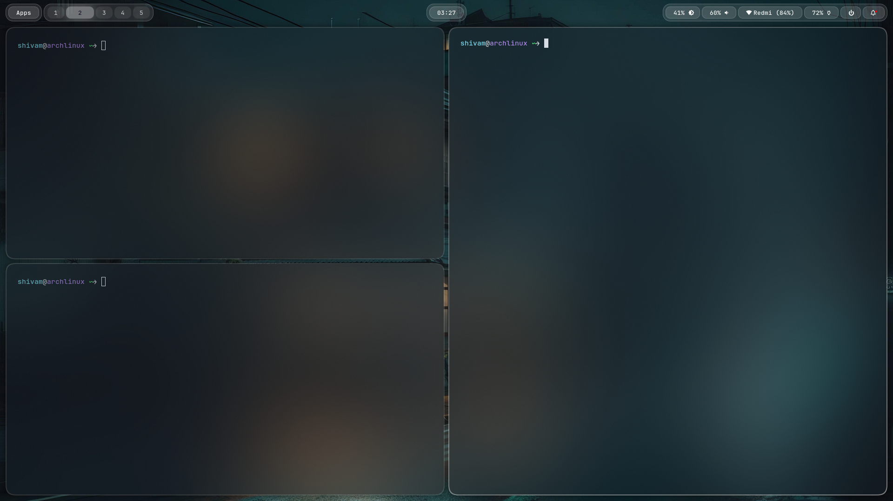

# Project-AE Dotfiles

Hyprland dotfiles managed with [GNU Stow](https://www.gnu.org/software/stow/).

## Preview

<div align="center">



*shivam@archlinux*

<br>


*shivam@archlinux*

<br>


*shivam@archlinux*

<br>



*shivam@archlinux*

<br>



*shivam@archlinux*

</div>

## Structure

```
stow/
├── hypr/        # Hyprland WM (lua config)
├── waybar/      # Status bar + 7 themes
├── kitty/       # Terminal emulator
├── fish/        # Shell
├── btop/        # System monitor
├── rofi/        # App launcher + wifi/screenshot/power/theme scripts
├── swaync/      # Notification center
├── waypaper/    # Wallpaper manager
├── eww/         # Widget system (yuck)
├── cava/        # Audio visualizer
├── mpv/         # Media player
├── nwg-bar/     # GTK bar
└── nwg-look/    # GTK settings
```

## Quick Install

```bash
git clone https://github.com/shivamThebug/Project-AE.git
cd Project-AE
```
```bash
chmod +x ./install.sh
./install.sh
```

This installs all packages (official + AUR) and deploys configs via Stow.

## Manual Deploy

```bash
cd stow
stow -t "$HOME" */
```

## Requirements

See `.requirement` for the full package list.

## Credits

Some scripts in this repo were drafted with AI assistance. If you
recognize a close resemblance to your own work, open an issue and
I'll credit/fix it.